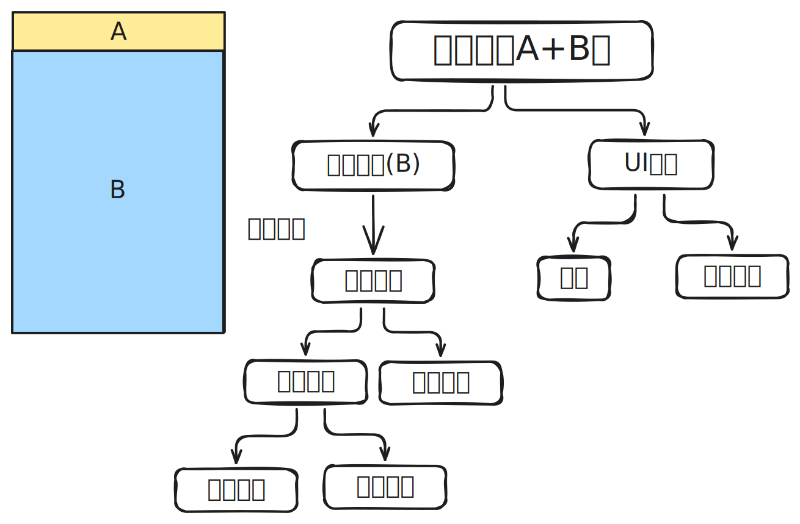
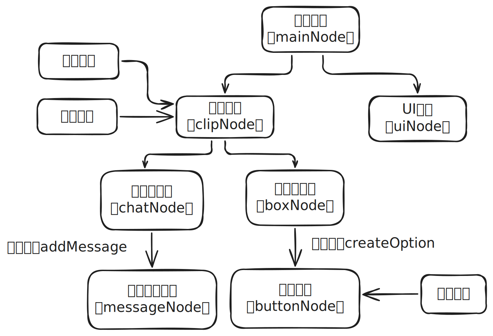

```plain
dora-ssr，聊天控件，仿微信聊天并通过点击选项来实现对话选择，可实现界面拖动
```

<h1 id="jtkF0">功能介绍</h1>
 本控件主要实现了一个基本的聊天界面类，可通过成员函数`addMessage`来添加对应的对话信息。  
 通过传入参数,`(x,y)`来控制聊天界面的位置（以左下角为原点）。`(width,height)`,来控制聊天界面的整体尺寸

<h1 id="NQYAI">待完善的功能</h1>

- [ ] 添加tsx标签格式的ui构建示例

- [ ] 修改显示方式为分块加载而不是全量加载

<h1 id="JzEOt">界面分析</h1>



如左上角的图像所示，本控件主要由聊天界面（功能界面），以及基础的UI界面组成。

而聊天界面由于还需要实现滚动的功能，所以需要额外添加一个裁剪区域用于放置ClipNode节点，用于裁剪出需要显示的区域（所以实质上，本控件当前会将所有的聊天记录同时加载出来，这在聊天记录较长的时候可能会产生一定的影响）

再往下就是最为基础的对话框，以及选项框了

<h1 id="wzwvI">界面实现</h1>


首先先对相应的节点进行设计，

1. 创建一个最根部的节点`mainNode`用于控制整体的宽高与位置，而其余节点通过添加为其子节点的形式，将坐标的设置更改为`mainNode`的左下角作为原点的相对坐标，以便于后续调整。

```tsx
mainNode.x = x;
mainNode.y = y;
```

2. 创建一个相对独立的节点`uiNode`用于保存在创建后就不接受任何更改的部分，如外部框架，整体标题等。需要注意的是`Label`中的`textWidth`和`alignment`以及`anchor`会严重影响到Label具体的展示效果

```tsx
const titleLabel = Label(fontPath, labelSize);
if (!titleLabel) error("failed to create label!");
titleLabel.text = titletxt;
titleLabel.anchor = Vec2(0, 1); // 修改节点的锚点（x,y）代表的点的相对位置（0,0）为左下角，（1,1）为右上角
titleLabel.textWidth = width; // 修改文本框的宽度,会影响对齐位置
titleLabel.color = labelColor;
titleLabel.alignment = TextAlign.Left;
titleLabel.y = height ;
this.uiNode.addChild(titleLabel);
const ui = DrawNode()
ui.drawSegment(Vec2(0,this.height-labelSize),Vec2(this.width,this.height-labelSize),borderWidth)
ui.drawPolygon([Vec2(0,0),Vec2(0,this.height),Vec2(this.width,this.height),Vec2(this.width,0)],Color(0),borderWidth,borderColor)
this.uiNode.addChild(ui)
```

3. 创建一个`DrawNode`节点来创建遮罩，用于控制裁剪节点`clipNode`具体裁剪的范围，如果希望仅不显示遮罩区域可以通过修改`clipNode.inverted =true;`的方式实现。

```tsx
// 创建一个 DrawNode 用于创建遮罩
const maskA = DrawNode();
maskA.drawPolygon([
  Vec2(0, 0),
  Vec2(0, this.height-labelSize), // 空出标题位置
  Vec2(width, this.height-labelSize),
  Vec2(width, 0)
]);
const clipNode = ClipNode(maskA);
```

4. 创建聊天主节点`chatNode`，用于后续使用成员函数`addMessage`动态添加聊天信息
5. 创建选项主节点`boxNode`，用于后续使用成员函数`createOption`动态添加选项信息
6. 添加`chatNode`与`boxNode`至`clipNode`以进行裁剪

```tsx
clipNode.addChild(this.chatNode, 1); // 控制渲染层级，1会被2覆盖
clipNode.addChild(this.boxNode, 2);
```

节点的基本逻辑就构建完了，后续就是补全相应成员函数以及初始化了

<h1 id="wzwvI">核心成员函数实现</h1>

## 1. `addMessage`
添加聊天信息
```tsx
	addMessage(in_left:boolean,role: string, text: string): void {
		const messageNode = Node(); // 定义当前信息的根节点
		const nameLabel = Label(this.fontPath, this.chatSize)!; // 定义名称(!表示无视格式检测，防止爆红)
		const textLabel = Label(this.fontPath, this.chatSize)!; // 定义信息
		const chatSpace = this.width; // 定义聊天框的宽度

		nameLabel.y = 0; // 由于后续将Label的锚点设置为了上方，所以直接设置为0即可
		textLabel.y = nameLabel.y - this.chatSize; // 信息的y坐标需要在下移一个字符的高度实现类似于换行的效果
		messageNode.addChild(nameLabel); // 添加至根节点方便统一管理位置
		messageNode.addChild(textLabel); // 添加至根节点方便统一管理位置
		messageNode.y = this.height - this.startChat ; // 设置根节点的位置为this.startChat

		nameLabel.color = this.chatColor; // 设置颜色
		textLabel.color = this.chatColor; // 设置颜色
		nameLabel.textWidth = chatSpace; // 宽度设置为整个聊天框的宽度
		textLabel.textWidth = chatSpace; // 宽度设置为整个聊天框的宽度

		textLabel.text = text; // 设置信息
		nameLabel.text = role + ":"; // 设置名称

		if (in_left) { // 如果是左边
			nameLabel.anchor = Vec2(0, 1.0); // 设置锚点为左上角
			textLabel.anchor = Vec2(0, 1.0); // 设置锚点为左上角
			nameLabel.x = this.chatSize; // 空出一个字符的宽度以保证显示的美观
			textLabel.x = this.chatSize; // 空出一个字符的宽度以保证显示的美观
			nameLabel.alignment = TextAlign.Left; // 设置对齐方式为左对齐
			textLabel.alignment = TextAlign.Left; // 设置对齐方式为左对齐
		} else { // 否则是右边
			nameLabel.anchor = Vec2(1.0, 1.0); // 锚点设置为右上角
			textLabel.anchor = Vec2(1.0, 1.0); // 锚点设置为右上角
			nameLabel.x = this.width - this.chatSize; // 空出一个字符的宽度以保证显示的美观
			textLabel.x = this.width - this.chatSize; // 空出一个字符的宽度以保证显示的美观
			nameLabel.alignment = TextAlign.Right; // 设置对齐方式为右对齐
			textLabel.alignment = TextAlign.Right; // 设置对齐方式为右对齐
		}
		this.startChat += textLabel.height + this.chatSize; // 计算下一个聊天节点的起始位置
		this.chatNode.addChild(messageNode); // 将当前聊天节点加入聊天主节点进行管理
	}
```


## 2. `createOption`
创建选项
``` tsx
createOption(
		text: string,
		choiceIndex: number,
		fillColor: Color.Type = Color(0xffffffff),
		borderColor: Color.Type = Color(0x00000000)
	): void {
		const buttonNode = Node(); // 创建按钮节点
		const buttonUI = DrawNode(); // 创建按钮UI
		const buttonLayout = Node(); // 创建按钮布局
		const label = Label(this.fontPath, this.chatSize)!; // 创建按钮文字
		buttonNode.addChild(buttonLayout); // 最先加载布局，作为基底（不带ui，不影响效果）
        buttonNode.addChild(buttonUI, 1); // 后加载底部的绘制
		buttonNode.addChild(label, 2); // 最后加载顶部的文字

		label.alignment = TextAlign.Left; // 设置对齐方式为左对齐
		label.color = this.chatColor; // 设置文字颜色
		label.text = "   " + text; // 设置文字内容
		label.textWidth = this.width - this.chatSize * 2; // 设置文字宽度(左右各空出一个字符的位置)
		buttonUI.x = this.chatSize // 设置按钮的x坐标(空出一个字符的位置)
		buttonUI.drawPolygon(
			[
				Vec2(0, 0),
				Vec2(0, label.height),
				Vec2(this.width - this.chatSize*2, label.height),
				Vec2(this.width - this.chatSize*2, 0)
			],
			fillColor,
			2,
			borderColor
		); // 绘制按钮背景区域,

		buttonNode.y = this.startBox + this.chatSize; // 
		
		// 扩大 buttonLayout 的点击区域，覆盖整个按钮宽度
		buttonLayout.size = Size(this.width- this.chatSize*2, label.height);
		buttonLayout.x = this.chatSize; // 偏移以覆盖整个宽度
		buttonLayout.anchor = Vec2(0,0)
		buttonLayout.onTapBegan(touch => {
			touch.enabled = false; // 阻止事件继续传播
			this.onOptionClick(choiceIndex); // 注册回调函数
			this.clearOptions();
		});

		this.boxNode.addChild(buttonNode); // 将按钮节点加入选项主节点进行管理
		this.startBox += label.height + this.chatSize / 2; // 计算下一个选项节点的起始位置
		this.optionCount++; // 计算选项数量
	}
```


# 输入检测部分
## 滚动实现
``` tsx 
clipNode.onTapMoved(touch => { // 检测到移动时,滚动识别区域是裁剪区域
	const newPos = this.chatNode.position.add(
		Vec2(0, touch.delta.y).normalize().mul(8)
	); // 修改聊天主节点的y值，normalize()大多数时候就是有移动就变为对应方向的1，而mul()则是用来控制拖动的速度
	this.chatNode.position = newPos; // 更新
});
```